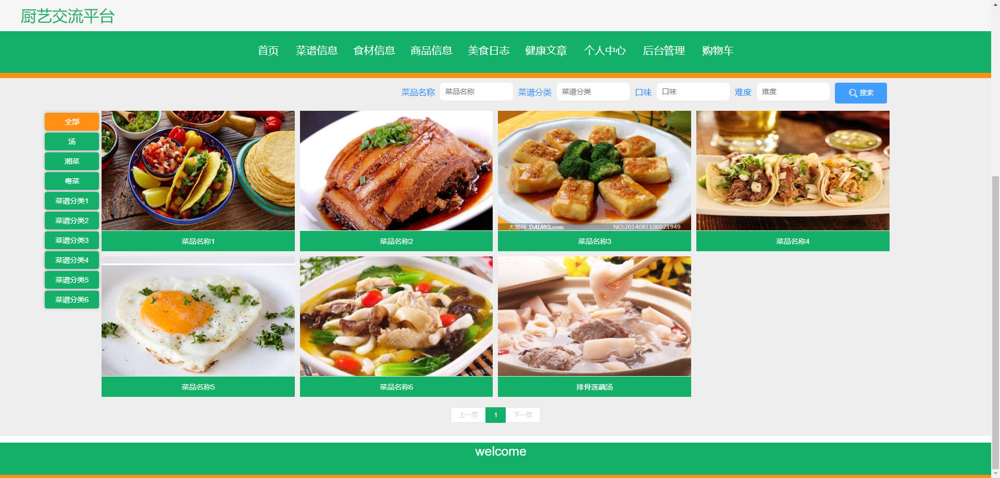
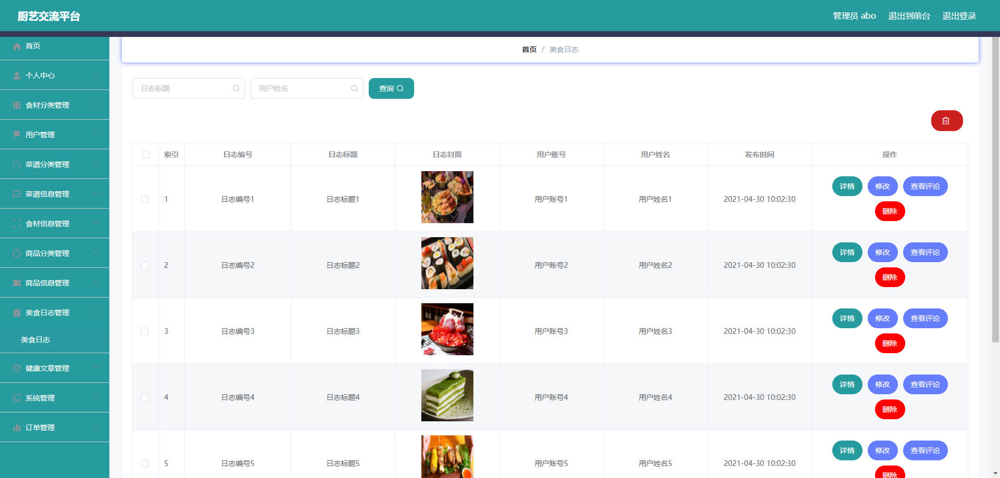

# 基于Springboot的厨艺交流平台

## Springboot-0093


## 技术栈

Springboot mybatisplus vue mysql maven


## 数据库表(21张)


## 功能介绍

```properties
平台功能有个人中心，食材分类管理，用户管理，菜品分类管理，菜谱信息管理，食材信息管理，商品分类管理，商品信息管理，美食日志管理，健康文章管理，系统管理，订单管理等。


```


## 图片

### 前台





### 后台




## 访问路径

### 前台

```properties
http://localhost:8080/springbooted1p6/front/pages/login/login.html

账号 111
密码 111
```

### 后台

```properties
http://localhost:8080/springbooted1p6/admin/dist/index.html#/login

账号 abo
密码 abo
```


## 功能图


## 文档目录


## 打赏或交流


